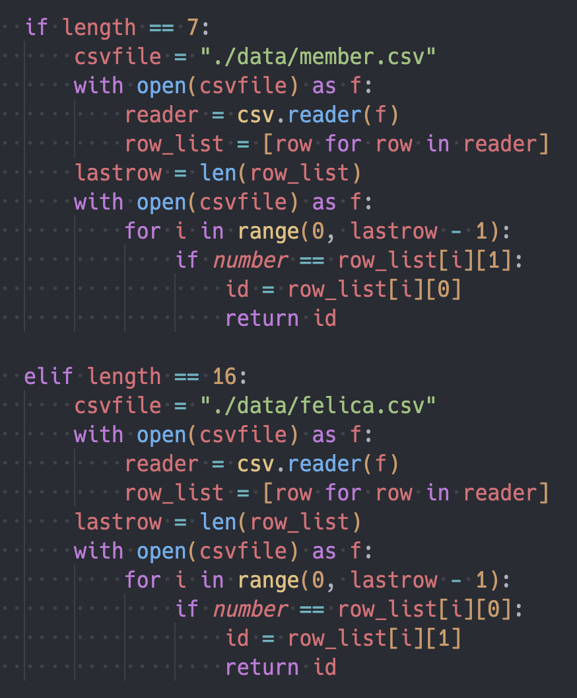
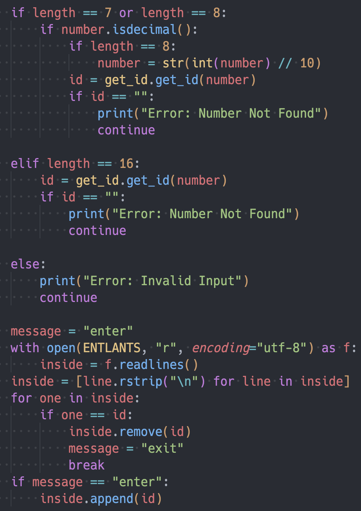
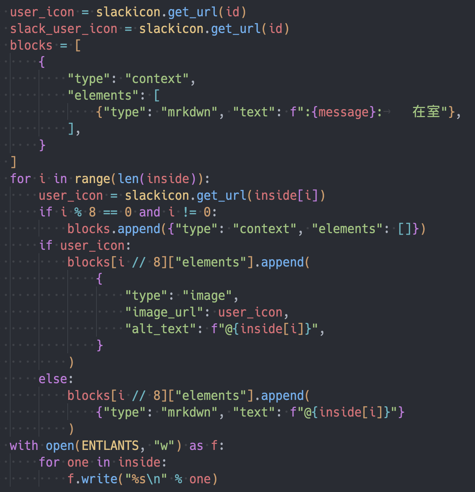

<!--
_header: ''
_paginate: false
_class: d-flex align-center justify-center text-center
-->

# 入退室管理ステム作ってみた

gae

---

# 目次

-   自己紹介
-   MMA ってなんなの
-   なんで作ったの
-   なにを作ったの
-   どう作ったの
-   今後どうするの

---

# 自己紹介

-   電気通信大学 2 年 情報通信工学
-   UECMMA 部長(2023)
-   主に部内ツールの開発
-   めんどくさいことを自動化する

---

# MMA ってなんなの

-   総合格闘技 (Mixed Martial Arts) ではなく，，
-   Microcomputer Making Association の略称
-   計算機に関係することならなんでもやるサークル
-   部員に対して開発に適した環境を提供している

---

# なんで作ったの

-   コロナ禍の入室者管理の必要性
-   部室にいる人に連絡したい
-   誰もいないのに部室の鍵が閉まってない！？

→ これまでは手打ちで"入室"や"退室"を入力していた
→ めんどくさいな → じゃあ楽にしちゃえ

---

# なにを作ったの

Python で入退室管理システムを作った

学生証にくっついているバーコードやみんなの IC カードをかざすと Slack に入退室の通知がいくようにした

---

# どうやって作ったの

構造はめっちゃ単純

1. バーコード or IC カードから番号を読み取る
2. その番号から MMA ID を特定
3. 入退室の判断をする
4. 結果を Slack に通知する

---

## 番号を読み取る

それぞれリーダから読み取る

## MMA ID を特定

バーコードは 7 桁の学籍番号
IC カードは 16 桁の 16 進数
データベース (csv) から探す

---

## 入退室の判断をする

ID が txt ファイルに

-   あれば 退室 → 削除
-   なければ 入室 → 追加

---

## Slack に通知

Slack API を使って通知
Outgoing Webhooks で

-   特定のチャンネル
-   特定のユーザ名
-   特定のアイコン
-   特定のメッセージ

を通知できる

---

## Slack に通知

Slack API を使って通知
Outgoing Webhooks で

-   #room_io
-   部員の MMA ID
-   部員のアイコン
-   入退室と在室者

を通知する

---

メインの処理はこれだけ．あとはその他の機能として，

-   毎朝 4 時に在室者をリセット
-   毎朝 4 時に データベースを更新
-   ID が見つからなかった時にデータベースを更新
-   毎時間 Slack のアイコンデータを更新
-   入退室のログを取っておく

がある．

---

## 苦労したこと

-   データベースの更新
    -   データが別サーバ内にある → 自動で持ってくるのが面倒
-   Slack 通知部分の装飾
    -   動作までに 2 日．装飾に 2 週間．
    -   アイコンによる表示，矢印による入退室の表示，など

---

# 今後どうするの

-   Raspberry Pi の再起動時，手動で python を実行
    -   自動で実行できるようにしたい
-   データベースの更新
    -   データベースから卒業生を自動削除できるようにしたい

---

<!--
_header: ''
_paginate: false
_class: d-flex align-center justify-center text-center
-->

# ご清聴ありがとうございました

